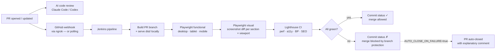

# Portfolio V2 — Soumadip Basu

Version 2 of the portfolio: all data and functionality migrated from **portfolio-master**
into the new terminal-inspired UI/UX design (JetBrains Mono + Space Grotesk, dark/light themes).

## Stack
- Vite 7 (vanilla JS, same stack as V1)
- Plain CSS with design tokens (`src/styles/`)
- No runtime dependencies

## Setup
```bash
npm install
```

Create a `.env` file in the project root (see `.env.example`):
```
VITE_GEMINI_API_KEY=your-gemini-api-key
VITE_WEB3FORMS_KEY=your-web3forms-access-key
```
`.env` is gitignored — keys are never committed and never appear in source files.
At build time each key is XOR-encoded into the bundle and decoded at runtime
(`src/modules/runtime-keys.js`), so the raw strings are not present verbatim in
the repository or the deployed assets. As with any fully static site, a client-side
key remains recoverable by a determined user — use free-tier/restricted keys only.

## Commands
| Command           | Purpose                                  |
|-------------------|------------------------------------------|
| `npm run dev`     | Local dev server → http://localhost:5173/portfolio-v2/ |
| `npm run build`   | Production build → `dist/`               |
| `npm run preview` | Preview the production build             |
| `npm run serve`   | Build + serve the site exactly as CI does (port 4173) |
| `npm run deploy`  | Publish `dist/` to GitHub Pages via gh-pages |
| `npm test`        | Run all Playwright tests (functional + visual, 3 viewports) |
| `npm run test:functional` | Functional tests only               |
| `npm run test:visual`     | Visual regression tests only        |
| `npm run test:update-snapshots` | Regenerate visual baselines   |
| `npm run test:report`     | Open the last Playwright HTML report |
| `npm run lhci`    | Lighthouse CI assertions (site must be served: `npm run serve`) |

## CI/CD quality gate — the workflow

Every pull request against `main` is built and tested automatically by a
self-hosted **Jenkins** pipeline before it can be merged. Merging is enforced
by a required GitHub status check — a red pipeline means the merge button is
disabled.



Step by step:

1. **A PR is raised** against `main`. The AI code review runs independently.
2. **GitHub notifies Jenkins** through a webhook (tunnelled with ngrok since
   Jenkins runs locally), or Jenkins discovers the PR on its periodic scan if
   the tunnel is down — both paths are configured.
3. **Jenkins builds the PR branch** inside the official Playwright Docker
   image and serves the built `dist/` on port 4173 — tests never touch the
   live site.
4. **Three test layers run**, all against that local server:
   - *Functional* (Playwright, 3 viewports): page load, every nav/anchor link
     resolves, all images load, social/contact links have the right hrefs,
     sections render, project filter + modal work, the contact form is
     exercised end-to-end against a **mocked** Web3Forms API, and the console
     must stay free of errors.
   - *Visual regression* (Playwright): a screenshot of **each section** is
     compared per viewport against committed baselines
     (`maxDiffPixelRatio` 2%).
   - *Performance* (Lighthouse CI): performance ≥ 0.85, accessibility ≥ 0.90,
     best-practices ≥ 0.90, SEO ≥ 0.90 (median of 3 runs).
5. **Jenkins posts the result** to the PR as the commit status
   `ci/jenkins/quality-gate` and publishes the Playwright + Lighthouse HTML
   reports as build artifacts.
6. **Green** → the PR is mergeable. **Red** → branch protection blocks the
   merge; if the optional `AUTO_CLOSE_ON_FAILURE` toggle is on, Jenkins also
   comments an explanation and closes the PR (reopenable after a fix).

## How the quality gate was set up

Everything lives in the repo; Jenkins just points at it. The pieces, in the
order they were built:

| # | Piece | Where | What it does |
|---|-------|-------|--------------|
| 1 | Central test config | [`tests/config.ts`](tests/config.ts) | Single place for viewports, base URL, expected links, diff tolerance — tweak here, not in specs |
| 2 | Playwright config | [`playwright.config.ts`](playwright.config.ts) | Three projects — `desktop` 1920×1080 (Chromium), `tablet` iPad Pro 11 (WebKit), `mobile` Pixel 7 (Chromium); HTML + JUnit reporters, trace on retry, auto build-and-serve via `webServer` |
| 3 | Functional specs | [`tests/functional/`](tests/functional/) | smoke, navigation, links, resources (broken images/requests), section content + interactions, console hygiene |
| 4 | Visual specs | [`tests/visual/`](tests/visual/) | One `toHaveScreenshot` per section per viewport; [`screenshot.css`](tests/visual/screenshot.css) freezes animated elements during capture so diffs only ever mean real UI changes |
| 5 | Lighthouse config | [`lighthouserc.cjs`](lighthouserc.cjs) | Category thresholds asserted against the locally served build |
| 6 | Pipeline | [`Jenkinsfile`](Jenkinsfile) | Declarative pipeline in the Playwright Docker image: checkout → install → build & serve → functional → visual → Lighthouse → publish reports → GitHub status → optional auto-close. The GitHub token is referenced only by credential ID (`github-pat`) — no secrets in the repo |
| 7 | Jenkins server guide | [`docs/JENKINS_SETUP.md`](docs/JENKINS_SETUP.md) | Local Jenkins install, plugins, credentials, multibranch PR job, ngrok webhook + polling fallback, troubleshooting |
| 8 | Merge enforcement | [`docs/BRANCH_PROTECTION.md`](docs/BRANCH_PROTECTION.md) | Making `ci/jenkins/quality-gate` a required status check on `main` |

Design decisions worth knowing:

- **Webhook reachability** — a local Jenkins isn't reachable from GitHub, so
  the default trigger is an **ngrok** tunnel (free static domain), with the
  multibranch **periodic scan** as a zero-dependency fallback. Both are
  documented and can coexist.
- **Blocking vs closing** — the required status check is the real merge gate.
  Auto-closing failed PRs is implemented but **off by default**
  (`AUTO_CLOSE_ON_FAILURE` env var in Jenkins), because closing loses reviewer
  context; when enabled, the close comes with an explanatory comment and
  reopen instructions.
- **Deterministic rendering** — the pipeline runs in the pinned
  `mcr.microsoft.com/playwright:v1.61.1-noble` image (must match the
  `@playwright/test` version in `package.json`), so browsers, fonts, and
  rasterization are identical on every run. Time-varying UI (typing loop,
  simulated test console, animated pipeline chips) is frozen or hidden during
  screenshot capture.
- **Hermetic tests** — the contact form's Web3Forms endpoint is mocked in the
  tests, so CI needs no API keys and no external calls; the site builds with
  empty keys in CI.

### Running the tests locally

```bash
npm install
npx playwright install        # one-time browser download
npm test                      # builds, serves, and runs everything
npm run test:report           # open the HTML report
```

`npm run lhci` needs the site served first (`npm run serve` in another
terminal). Note: on Windows the Lighthouse CLI has a known temp-cleanup crash
(`EPERM … Temp\lighthouse.*`) *after* the audit completes — the scores are
fine in CI (Linux); see the troubleshooting table in
[docs/JENKINS_SETUP.md](docs/JENKINS_SETUP.md#7-troubleshooting).

### Visual baselines

Baselines live in `tests/visual/__screenshots__/<viewport>/<platform>/` —
per viewport **and** per platform, so local Windows baselines and CI's Linux
baselines never collide. The **Linux** ones are the merge gate.

- **First CI run:** no Linux baselines exist yet — the pipeline creates them,
  marks the build UNSTABLE with instructions (the PR check still passes), and
  attaches them as artifacts. Download `tests/visual/__screenshots__/**`,
  commit, done.
- **Intentional UI change:** regenerate and commit, either by taking the
  updated images from the failed build's Playwright report/artifacts, or by
  generating Linux baselines locally in the same image CI uses:

  ```bash
  docker run --rm -v "$PWD":/work -w /work -u root --ipc=host \
    mcr.microsoft.com/playwright:v1.61.1-noble \
    sh -c "npm ci && npm run test:update-snapshots"
  ```

- Any diff beyond the 2% tolerance (`tests/config.ts`) fails the build; the
  Playwright report shows expected / actual / diff side by side.

### The auto-close toggle

| `AUTO_CLOSE_ON_FAILURE` | Behaviour on a failed PR build |
|---|---|
| `false` *(default)* | PR stays open; merge stays blocked by the required check |
| `true` | Same, **plus** Jenkins comments why it failed and closes the PR |

Set it in Jenkins under *Manage Jenkins → System → Global properties →
Environment variables* — see
[docs/JENKINS_SETUP.md](docs/JENKINS_SETUP.md#the-auto-close-toggle).

## Structure
```
index.html            page markup (all real content from portfolio-master)
public/               reused assets (photo, resume PDF, favicon)
src/
  main.js             entry — wires up all modules
  data/               content data (projects, certificates, chatbot context)
  modules/            one feature per file (theme, nav, hero, reveal, timeline,
                      projects, certifications, contact-form, widgets, chatbot)
  styles/             theme tokens, layout, components, chatbot, responsive
```

## Features carried over from V1
Theme toggle (persisted), smooth-scroll nav + scrollspy, mobile hamburger menu,
scroll-reveal + counters, project detail modals (back-button aware), certificate
verification modals, Web3Forms contact form, resume view/download (+ floating FAB),
scroll-to-top, cursor trail, and the Gemini AI chatbot (model fallback chain, retry,
typing indicator, conversation starters, history trimming).
